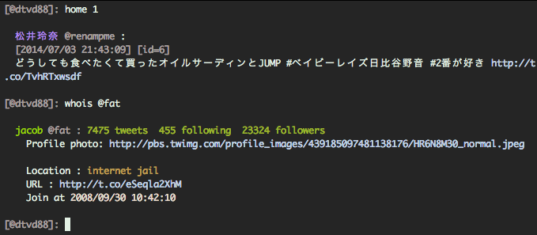

## Available themes
#### Default

#### Monokai

#### Solarized


## Customize:
Create a file `~/.rainbow_config.json` and follow next instruction.

Examples are available in 
[Monokai theme](https://github.com/DTVD/rainbowstream/blob/master/rainbowstream/colorset/monokai.json)
or
[Solarized theme](https://github.com/DTVD/rainbowstream/blob/master/rainbowstream/colorset/solarized.json).

### Custom config
 * Config file's name should be exactly `.rainbow_config.json` and placed at home directory.
 * Config file's content should follow json format.
 * Comments as `//` or `/*...*/` are allowed.
 * Here is an example

```json
{
    "DECORATED_NAME" : "term_198",
    "CYCLE_COLOR" :["term_198","term_57","term_166","term_50","term_179","term_74","term_112"],
    "TWEET" : {
        "nick"      : "term_112",
        "clock"     : "term_57",
        "id"        : "term_166",
        "favourite" : "term_50",
        "rt"        : "term_179",
        "link"      : "term_74",
        "keyword"   : "on_light_green"
    },

    "MESSAGE" : {
        "sender"    : "term_112",
        "recipient" : "term_112",
        "to"        : "term_50",
        "clock"     : "term_57",
        "id"        : "term_166"
    },

    "PROFILE" : {
        "statuses_count"    : "term_112",
        "friends_count"     : "term_198",
        "followers_count"   : "term_57",
        "nick"              : "term_198",
        "profile_image_url" : "term_74",
        "description"       : "term_166",
        "location"          : "term_112",
        "url"               : "term_74",
        "clock"             : "term_57"
    },

    "TREND" : {
        "url": "term_74"
    }
}
```

### Available Colors

There are 16 basic colors:
  * default
  * black
  * red
  * green
  * yellow
  * blue
  * magenta
  * cyan
  * grey
  * light_red
  * light_green
  * light_yellow
  * light_blue
  * light_magenta
  * light_cyan
  * white

These colors will be enough for almost terminals.
But if your terminal can support 256 colors (check your `$TERM` variable!), 
you can even use `term_0` to `term_255` as the example above.

Color reference can be found at 
[bash colors](http://misc.flogisoft.com/bash/tip_colors_and_formatting) or 
[256 xterm colors](http://www.calmar.ws/vim/256-xterm-24bit-rgb-color-chart.html).

### Available options
* `DECORATED_NAME`: color of your Twitter's __username__ which is placed at every line's begin.
* `CYCLE_COLOR`: list of colors from which Twitter __real name__ 's color is selected. 
  * Color selection is cycle through this list but with _memoization_. 
  * It's means that same names will appear in same colors.
* `TWEET`: colors of parts in a tweet's ouput.
  * `nick` : color for Twitter __username__.
  * `clock`: color for time of tweet.
  * `id`: color for Tweet's id
  * `favorite`: color for the star symbol when a tweet is favorited by you
  * `rt`: color for `RT` word in tweet's content.
  * `link`: color for an url
  * `keyword`: color for highlighted keyword (in tweets search) 
* `MESSAGE`: colors of parts in message's output.
  * `sender`: color for sender's __username__.
  * `recipient`: color for recipient's __username__.
  * `to`: color for the `>>>` symbol.
  * `clock`: color for time of message.
  * `id`: color for message's id
* `PROFILE`: colors for parts in profile's ouput.
  * `statuses_count`: color for statuses count.
  * `friends_count`: color for friends count.
  * `followers_count`: color for followers count.
  * `nick`: color for Twitter __username__.
  * `profile_image_url`: color for profile image url.
  * `description`: color for description.
  * `location`: color for location.
  * `url`: color for url.
  * `clock`: color for joined time.
* `TREND`: colors for trend's output:
  * `url`: color for trend's url.

