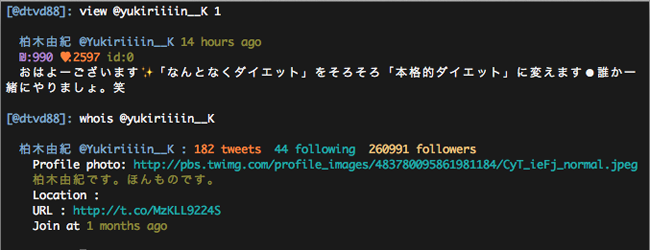

## Available themes
#### Monokai

#### Solarized

#### Tomorrow Night

#### Larapaste


## Customization
Modify `~/.rainbow_config.json` and follow next instruction.

Examples are available in
[Themes folder](https://github.com/DTVD/rainbowstream/blob/master/rainbowstream/colorset)

### Custom config
 * There is a file named exactly `.rainbow_config.json` and is placed at your home directory.
 * Add color configurations to above file and follow json format.
 * Comments as `//` or `/*...*/` are allowed.
 * Here is an example

```json
{
    "DECORATED_NAME" : 198,
    "CYCLE_COLOR" :[198,57,166,50,179,74,112],
    "TWEET" : {
        "nick"            : 112,
        "clock"           : 57,
        "id"              : 166,
        "favorited"       : 50,
        "retweet_count"   : 50,
        "favorite_count"  : 198,
        "rt"              : 179,
        "link"            : 74,
        "hashtag"         : 198,
        "keyword"         : "on_light_green"
    },

    "MESSAGE" : {
        "partner"       : 112,
        "me"            : 112,
        "me_frame"      : 74,
        "partner_frame" : 198,
        "sender"        : 112,
        "recipient"     : 112,
        "to"            : 50,
        "clock"         : 57,
        "id"            : 166
    },

    "PROFILE" : {
        "statuses_count"    : 112,
        "friends_count"     : 198,
        "followers_count"   : 57,
        "nick"              : 198,
        "profile_image_url" : 74,
        "description"       : 166,
        "location"          : 112,
        "url"               : 74,
        "clock"             : 57
    },

    "TREND" : {
        "url": 74
    },

    "CAL" : {
        "days": 57,
        "today": "on_light_blue"
    },

    "GROUP" : {
        "name": 112,
        "member": 57,
        "subscriber": 198,
        "mode": 112,
        "description": 166,
        "clock": 57
    }
}
```

### Available Colors

There are 16 basic colors:
  * default
  * black
  * red
  * green
  * yellow
  * blue
  * magenta
  * cyan
  * grey
  * light_red
  * light_green
  * light_yellow
  * light_blue
  * light_magenta
  * light_cyan
  * white

These colors will be enough for almost terminals.
But if your terminal can support 256 colors (check your `$TERM` variable!),
you can even use 0 to 255 as the example above.

There are also background highlight colors like:
  * on_default
  * on_black
  * on_red
  * on_green
  * on_yellow
  * on_blue
  * on_magenta
  * on_cyan
  * on_grey
  * on_light_red
  * on_light_green
  * on_light_yellow
  * on_light_blue
  * on_light_magenta
  * on_light_cyan
  * on_white


Color reference can be found at
[bash colors](http://misc.flogisoft.com/bash/tip_colors_and_formatting) or
[256 xterm colors](http://www.calmar.ws/vim/256-xterm-24bit-rgb-color-chart.html).

### Available options
* `DECORATED_NAME`: color of your Twitter's __username__ which is placed at every line's begin.
* `CYCLE_COLOR`: list of colors from which Twitter __real name__ 's color is selected.
  * Color selection is cycle through this list but with _memoization_.
  * It's means that same names will appear in same colors.
* `TWEET`: colors of parts in a tweet's ouput.
  * `mynick` : color for your Twitter __username__.
  * `nick` : color for other Twitter __username__.
  * `clock`: color for time of tweet.
  * `id`: color for tweet's id.
  * `favorite`: color for the star symbol when a tweet is favorited by you.
  * `retweet_count`: color for retweets count.
  * `favorite_count`: color for favorites count.
  * `rt`: color for `RT` word in tweet's content.
  * `link`: color for an url.
  * `hashtag`: color for a hashtag.
  * `mytweet`: color for tweet's text from yourself.
  * `keyword`: color for highlighted keyword (in tweets search).
* `MESSAGE`: colors of parts in message's output.
  * `partner`: color for __partner__.
  * `me`: color for __authenticated user__.
  * `partner_frame`: color for __partner's frame__.
  * `me_frame`: color for __authenticated user's frame__.
  * `sender`: color for sender's __username__.
  * `recipient`: color for recipient's __username__.
  * `to`: color for the `>>>` symbol.
  * `clock`: color for time of message.
  * `id`: color for message's id.
* `PROFILE`: colors for parts in profile's ouput.
  * `statuses_count`: color for statuses count.
  * `friends_count`: color for friends count.
  * `followers_count`: color for followers count.
  * `nick`: color for Twitter __username__.
  * `profile_image_url`: color for profile image url.
  * `description`: color for description.
  * `location`: color for location.
  * `url`: color for url.
  * `clock`: color for joined time.
* `TREND`: colors for trend's output:
  * `url`: color for trend's url.
* `CAL`: colors for calendar's output:
  * `days`: color for days in current month.
  * `today`: color for today.
* `GROUP`: colors for twitter list output:
  * `name`: color for twitter list's name.
  * `member`: color member count.
  * `subscriber`: color subscriber count.
  * `mode`: color twitter list's mode.
  * `description`: color twitter list's description.
  * `clock`: color twitter list's created time.

### Theme usage
While entered Rainbow Stream:
* `theme` and hit ENTER to see which is available.
* `theme` + TAB twice will show themes list instantly.
* `theme monokai` will apply `monokai` theme immediately. You can use TAB key for theme's name autocompletion.

### Theme contribution
I appreciate any contribution for themes for this app.
Please add a file to [themes folder](https://github.com/DTVD/rainbowstream/tree/master/rainbowstream/colorset)
(json format!) and create a [pull request](https://github.com/DTVD/rainbowstream/compare/) with a screenshot.
